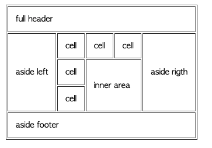

# Kodemia-Maquetado-retos-C01
## [WEB](sergio-gonzalez-sainz.github.io/kodemia-maquetado-retos-c01/)

# Codigo fuente

## [Terea 01: CV](https://github.com/sergio-gonzalez-sainz/Kodemia-Maquetado-retos-C01/tree/master/reto-01-cv)
 

## [Terea 02: tabla](https://github.com/sergio-gonzalez-sainz/Kodemia-Maquetado-retos-C01/tree/master/reto-02-tabla)
 

## [Terea 03: form](https://github.com/sergio-gonzalez-sainz/Kodemia-Maquetado-retos-C01/tree/master/reto-03-form)
 
